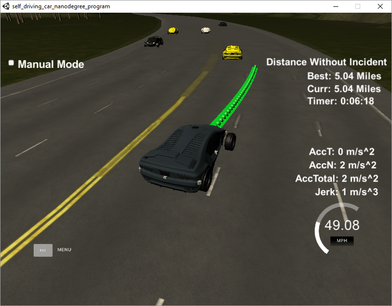
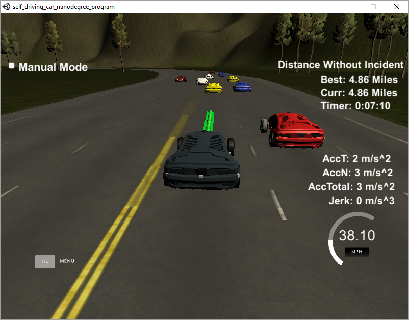

# CarND-Path-Planning-Project
Author : Manoj Kumar Subramanian

Self-Driving Car Engineer Nanodegree Program

## Overview

This repository is as part of my Submission to the Project 1: Path Planning Project for the Udacity Self Driving Car Nano Degree Program Term 3.

In this project,  a path planner is realized in C++ to provide the control signals for a vehicle in a simulated environment to stay on to a lane and move to the target speed limit as much as possible without colliding with other vehicles and if required the vehicle shifts to the next lane when it is safe.  







### Goals

In this project our goals are 

1. To safely navigate a car around a virtual highway with other traffic that is driving +-10 MPH of the 50 MPH speed limit. We will be provided the car's localization and sensor fusion data, there is also a sparse map list of waypoints around the highway. 
2. The car should try to go as close as possible to the 50 MPH speed limit without exceeding it.
3. The car should avoid hitting other cars. 
4. The car should drive inside the lanes but when it is required to shift lanes then it should. The changing of lanes should be safer.
5. Also the car should not experience total acceleration over 10 m/s^2 and jerk that is greater than 10 m/s^3.

## Reflections

### Initializations

A Vehicle class is created to realize a car with the parameters provided from the simulator. The quiz exercise provided as part of the course is taken as a first step in developing the Vehicle class and added parameters to it.

The same Vehicle class is used for initializing the EGO vehicle and the other vehicles. 

The implementation is divided into two categories:

1. Planning

2. Trajectory Generation

   ------

   ​

### Planning

The Planning section comprised of three categories:

1. Finite State Machine
2. Prediction
3. Cost based Best state selection

#### **Finite State Machine**

The Planning section first analyzes the current state of the EGO vehicle and assumes the probable Next States. The following three states were used to make the Finite State Machine for the EGO Vehicle and listed in the function `vector<string> Vehicle::successor_states()`.

1. Keep Lane
2. Lane Change Left and
3. Lane Change Right

#### **Prediction**

The `vector<Vehicle> Vehicle::generate_predictions(int duration)` function provides the list of probable location of all the other vehicles in the environment in the next cycles. The list is added to the predictions map which is used to understand and avoid collisions in the planner.

All the other vehicles are assumed to be in Keep Lane state (though those vehicles also shift lanes). 

#### **Cost based Best state selection**

The `vector<Vehicle> Vehicle::choose_next_state(map<int,vector<Vehicle>> predictions)` function goes through the probable states and finds out the best state based on cost assumptions.

The `double Vehicle::keep_lane_cost(map<int,vector<Vehicle>> predictions)` function provides the cost for keeping the EGO vehicle in the current lane with the probable collision to the vehicles in front.

The `double Vehicle::lane_change_cost(map<int,vector<Vehicle>> predictions, const int offset)` function provides the cost for shifting a lane taking into considerations of whether there is a possibility of collision to the vehicles in the next lanes both front and behind.

The best state is chosen based on the minimum cost. If there is no possible lane shifting and a vehicle in front, then the EGO vehicle adapts to the vehicle speed in front.

------


### Trajectory Generation

The Trajectory Generation portion provides the target lane and target speed to the Waypoints section. 

Based on the best intended state machine, the target lane is provided by the function 

`vector<Vehicle> Vehicle::generate_trajectory(string state, map<int, vector<Vehicle>> predictions)`

If there is a vehicle in front in the intended lane, then the target speed is set to the speed of the vehicle in front otherwise, the speed limit is considered as the target speed by the function.

#### **Longitudinal Acceleration and Jerk**

To reduce the Jerk and Acceleration in the longitudinal direction, the speed at the way points is incremented or decremented to a constant of 0.224 which helps in keeping the vehicle dynamics within in limits of the goals mentioned.

#### **Latitudinal Acceleration and Jerk with Spline**

For the latitudinal Jerk and Acceleration minimization, the lane shift distance is assumed to be of more than 30m and the spline function is used to have a smoother travel. The Waypoints section based on the map uses the spline function to create a smooth transition between the waypoints.

A really helpful resource for doing this project and creating smooth trajectories was using <http://kluge.in-chemnitz.de/opensource/spline/>, the spline function is in a single header file is really easy to use.


## Scope of improvements

Though the project rubrics are being met with the current level of implementation, the following will add up in improving the path planner project.

1. Calculating the derivatives of s and d (s, s_dot, s_double_dot and d, d_dot, d_double_dot) for the current state and the intended states, with the help of Jerk Minimization Trajectory (JMT) techniques, the smoother transition between the states can be achieved. This provides us opportunity to normally randomize the intended state parameters and select the best among the trajectories with the help of Trajectory based cost functions and parameter limits.
2. Converting other vehicles to s and d also allows as the prediction table of other vehicles which intended to shift lanes.

------


## Additional README Instructions

### Simulator

This project involves the Term 3 Simulator. You can download the Term3 Simulator which contains the Path Planning Project from the [releases tab (https://github.com/udacity/self-driving-car-sim/releases/tag/T3_v1.2).


#### The map of the highway is in data/highway_map.txt
Each waypoint in the list contains  [x,y,s,dx,dy] values. x and y are the waypoint's map coordinate position, the s value is the distance along the road to get to that waypoint in meters, the dx and dy values define the unit normal vector pointing outward of the highway loop.

The highway's waypoints loop around so the frenet s value, distance along the road, goes from 0 to 6945.554.

## Basic Build Instructions

1. Clone this repo.
2. Make a build directory: `mkdir build && cd build`
3. Compile: `cmake .. && make`
4. Run it: `./path_planning`.

Here is the data provided from the Simulator to the C++ Program

#### Main car's localization Data (No Noise)

["x"] The car's x position in map coordinates

["y"] The car's y position in map coordinates

["s"] The car's s position in frenet coordinates

["d"] The car's d position in frenet coordinates

["yaw"] The car's yaw angle in the map

["speed"] The car's speed in MPH

#### Previous path data given to the Planner

//Note: Return the previous list but with processed points removed, can be a nice tool to show how far along
the path has processed since last time. 

["previous_path_x"] The previous list of x points previously given to the simulator

["previous_path_y"] The previous list of y points previously given to the simulator

#### Previous path's end s and d values 

["end_path_s"] The previous list's last point's frenet s value

["end_path_d"] The previous list's last point's frenet d value

#### Sensor Fusion Data, a list of all other car's attributes on the same side of the road. (No Noise)

["sensor_fusion"] A 2d vector of cars and then that car's [car's unique ID, car's x position in map coordinates, car's y position in map coordinates, car's x velocity in m/s, car's y velocity in m/s, car's s position in frenet coordinates, car's d position in frenet coordinates. 

## Details

1. The car uses a perfect controller and will visit every (x,y) point it recieves in the list every .02 seconds. The units for the (x,y) points are in meters and the spacing of the points determines the speed of the car. The vector going from a point to the next point in the list dictates the angle of the car. Acceleration both in the tangential and normal directions is measured along with the jerk, the rate of change of total Acceleration. The (x,y) point paths that the planner recieves should not have a total acceleration that goes over 10 m/s^2, also the jerk should not go over 50 m/s^3. (NOTE: As this is BETA, these requirements might change. Also currently jerk is over a .02 second interval, it would probably be better to average total acceleration over 1 second and measure jerk from that.

2. There will be some latency between the simulator running and the path planner returning a path, with optimized code usually its not very long maybe just 1-3 time steps. During this delay the simulator will continue using points that it was last given, because of this its a good idea to store the last points you have used so you can have a smooth transition. previous_path_x, and previous_path_y can be helpful for this transition since they show the last points given to the simulator controller with the processed points already removed. You would either return a path that extends this previous path or make sure to create a new path that has a smooth transition with this last path.

## Dependencies

* cmake >= 3.5
  * All OSes: [click here for installation instructions](https://cmake.org/install/)
* make >= 4.1
  * Linux: make is installed by default on most Linux distros
  * Mac: [install Xcode command line tools to get make](https://developer.apple.com/xcode/features/)
  * Windows: [Click here for installation instructions](http://gnuwin32.sourceforge.net/packages/make.htm)
* gcc/g++ >= 5.4
  * Linux: gcc / g++ is installed by default on most Linux distros
  * Mac: same deal as make - [install Xcode command line tools]((https://developer.apple.com/xcode/features/)
  * Windows: recommend using [MinGW](http://www.mingw.org/)
* [uWebSockets](https://github.com/uWebSockets/uWebSockets)
  * Run either `install-mac.sh` or `install-ubuntu.sh`.
  * If you install from source, checkout to commit `e94b6e1`, i.e.
    ```
    git clone https://github.com/uWebSockets/uWebSockets 
    cd uWebSockets
    git checkout e94b6e1
    ```

